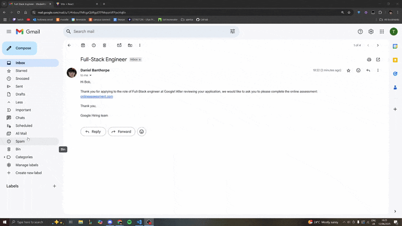

# LifeDash - AI-Powered Job & Productivity Tracker

**Live Demo:** [**https://life-dash-psi.vercel.app//**](https://life-dash-psi.vercel.app)

As this app requests Google permissions, and it is not a verified production piece, I have to manually verify emails. Therefore, please log in with the following credentials:

Email: lifedashtest@gmail.com \
Password: GuestPass200!

Then, if you would like to test the sync feature, send a dummy email about a job application to the above email address and hit sync! Please note, the backend server is hosted on a free tier service so may take some minutes to spin up in order to login.

## About The Project

LifeDash is a full-stack web application designed to be a central hub for personal productivity and job searching. I built this project to solve a personal problem: the difficulty of tracking job applications, managing daily tasks, and staying organized during the job hunt. 

The standout feature is an AI-powered Gmail sync that automatically scans for emails related to job applications, uses a language model to interpret their content, and intelligently creates or updates application records in the user's dashboard.

This project was built from scratch and demonstrates a full range of modern web development skills, from a secure RESTful API back-end to a responsive React front-end, all deployed on a live production environment.

---

### Tech Stack

This project is built with the MERN stack and leverages several modern technologies:

| Front-End | Back-End | Database | AI / APIs | Deployment |
| :---: | :---: | :---: | :---: | :---: |
|  |  |  |  |  |
|  |  |  |  |  |

---

### Features

*   **Secure User Authentication:** Full JWT-based authentication flow with hashed passwords.
*   **Task Management:** A full CRUD interface for creating, reading, updating, and deleting daily tasks.
*   **Intelligent Job Tracker:** 
    *   Manually add, edit, and delete job applications.
    *   Expandable rows to view the interaction history for each application.
*   **AI-Powered Gmail Sync:**
    *   Securely connect a Google account using OAuth 2.0.
    *   On-demand sync scans for recent, relevant job application emails.
    *   Uses a Hugging Face language model to classify emails and extract key data (company name, status, next steps).
    *   Intelligently creates new applications or updates existing ones, preventing duplicates.

---
